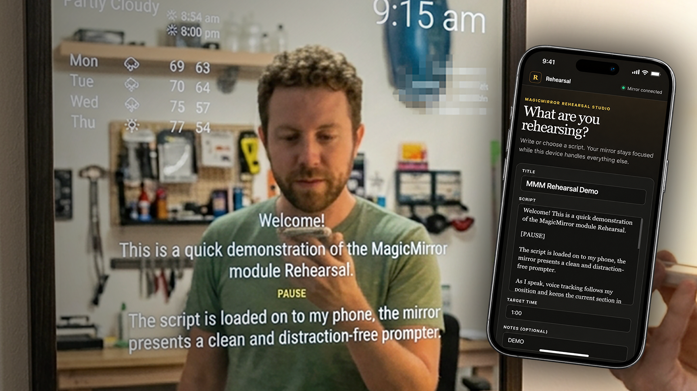
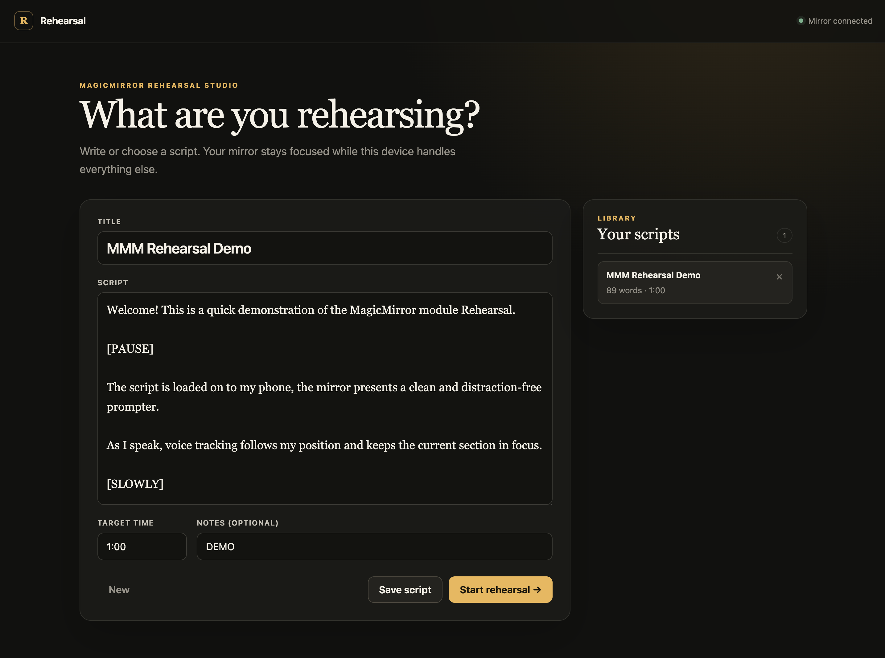
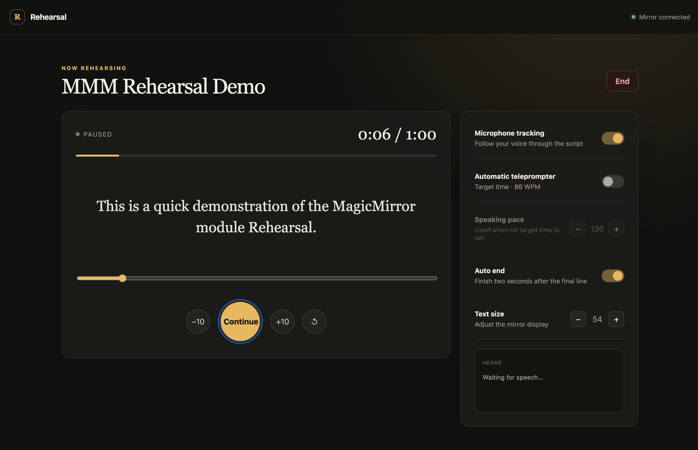
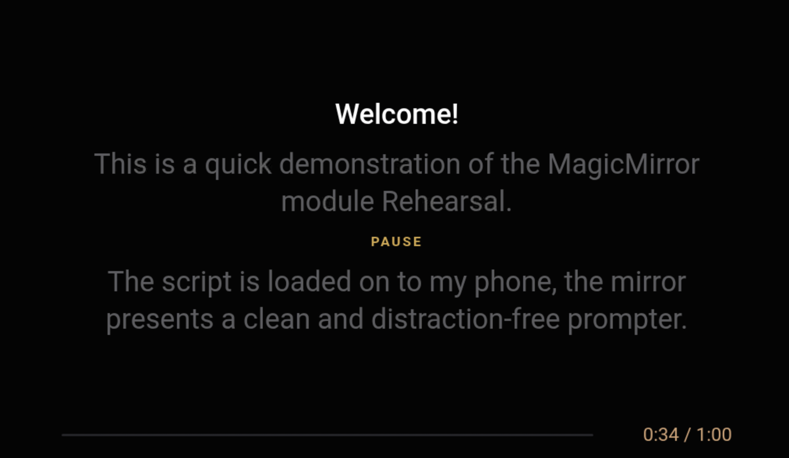

# MMM-Rehearsal

A focused rehearsal screen for MagicMirror².

Write or choose a script on your phone or laptop, then rehearse on the mirror. The mirror shows only what you need while you speak. No account is required, and your scripts stay on your MagicMirror.

**Status:** Stable and actively maintained.



## Experience

The browser controller keeps script and rehearsal controls away from the practice display.

| Script editor and library | Live rehearsal controls |
| --- | --- |
|  |  |

The mirror presents only the current speaking context, cues, progress, and timing.



## Install

From your MagicMirror `modules` directory:

```bash
git clone https://github.com/bwente/MMM-Rehearsal.git
cd MMM-Rehearsal
npm ci --omit=dev
```

See [Configuration](#configuration) for the module block. Microphone features also require the HTTPS setup described below.

## Update

From the module directory:

```bash
git pull --ff-only
npm ci --omit=dev
```

Restart MagicMirror after updating.

## HTTPS and microphone access

Browsers generally allow microphone access only from a secure context. MagicMirror can provide HTTPS directly. These options belong at the top level of `config/config.js`, not inside the module's `config` object:

```js
useHttps: true,
httpsPrivateKey: "/home/pi/MagicMirror/certs/magicmirror-key.pem",
httpsCertificate: "/home/pi/MagicMirror/certs/magicmirror-cert.pem",
```

Replace the paths with the real certificate and private-key paths on your mirror. Configure MagicMirror's `address` and `ipWhitelist` for the devices on your trusted local network. The certificate must be trusted by the phone or laptop for reliable microphone permission. The editor and manual remote still work over HTTP, but microphone tracking and voice analysis require HTTPS.

If HTTPS is already terminated by a reverse proxy such as Caddy or nginx, leave MagicMirror's `useHttps` set to `false` and let the proxy provide HTTPS instead. Do not enable TLS in both places unless the proxy is explicitly configured to connect to an HTTPS upstream.

Speech tracking uses your browser's speech recognition. Depending on the browser, recognition may happen on the device or through the browser vendor's service. MMM-Rehearsal does not send or store your audio.

After restarting MagicMirror, open `https://YOUR-MIRROR:8080/rehearsal` or scan the QR code shown on the mirror.

## Controller

The controller supports:

- Plain-text script editing and a local script library
- Optional target duration and notes
- Start, pause, continue, restart, stop, ±10-word jumps, and direct position selection
- Focus mode with microphone tracking, tolerant local script matching, and full-script recovery
- Auto mode with paced section changes using the target time or an adjustable 60–220 WPM
- Classic mode with smooth, continuous full-script scrolling
- Optional voice analysis in Auto and Classic modes without changing prompt movement
- Optional auto end, enabled by default, two seconds after reaching the final script line
- Mirror text-size adjustment
- Automatic session recovery after the controller page is reloaded or reopened
- Remembered presentation mode, auto-end, speaking-pace, and text-size preferences
- Duration, target, pace, longest-pause, and coverage summary
- Estimated script accuracy and up to three suggested lines to review in Rehearsal Studio when voice analysis is active
- Encouraging result messages that reflect the estimated accuracy range
- Localized mirror and controller interfaces in Bulgarian, Danish, German, English, Spanish, French, Hungarian, Dutch, Russian, and Thai
- A compact scoring summary on the mirror and detailed coaching in Rehearsal Studio

Scripts are stored locally in `data/scripts.json`, which is excluded from version control. Bracketed lines such as `[PAUSE]`, `[SLOW]`, and `[SLIDE: 2]` are displayed as cues and excluded from spoken-word matching.

The mirror uses MagicMirror's configured `language`. The controller follows the phone or laptop browser language and falls back to English. When browser speech recognition is unavailable, Focus is disabled and Auto or Classic provides a timing-only summary.

## Controller theming

Rehearsal Studio uses Bootstrap 5.3 color tokens and components, with Bootstrap stored locally so the controller does not need internet access. Bootstrap's JavaScript is not loaded.

To customize the controller without changing tracked module files, copy the included example:

```bash
cp controller/theme.example.css data/rehearsal-theme.css
```

Edit `data/rehearsal-theme.css`, then reload Rehearsal Studio. The file loads after the built-in styles and is excluded from Git, so normal module updates will not replace personal colors. Start with Bootstrap variables such as `--bs-body-bg`, `--bs-body-color`, `--bs-primary`, `--bs-secondary-color`, and `--bs-border-color`. The example also lists the Rehearsal-specific surface variables.

## Configuration

Add this block inside the `modules` array in `config/config.js`:

```js
{
  module: "MMM-Rehearsal",
  position: "fullscreen_above",
  config: {
    focusLines: 3,
    fontSize: 54,
    showProgress: true,
    showTargetTime: true,
    hideOtherModules: true
  }
},
```

Focus mode and voice analysis are enabled by default in Rehearsal Studio. Presentation preferences are remembered in that browser.

| Option | Default | Purpose |
| --- | ---: | --- |
| `focusLines` | `3` | Maximum visible spoken sentences; cues between them do not count |
| `fontSize` | `54` | Mirror text size in pixels (safely capped at 72) |
| `focusPosition` | `48` | Vertical focus point as a screen percentage |
| `textAlign` | `center` | `left`, `center`, or `right` |
| `lineSpacing` | `1.35` | Spoken-text line height |
| `contrast` | `high` | Use `soft` for dimmer surrounding text |
| `showProgress` | `true` | Show the thin progress indicator |
| `showTargetTime` | `true` | Show target beside elapsed time |
| `showCues` | `true` | Show bracketed cues |
| `hideOtherModules` | `true` | Hide other modules with a MagicMirror visibility lock while a rehearsal is ready or active |
| `controllerUrl` | `""` | LAN origin used by the QR code; auto-detected when empty |

## Development

```bash
npm test
```

The real-time channel uses Server-Sent Events for controller updates plus MagicMirror's built-in module socket for mirror updates. Controller actions use a small local HTTP API; no account or external service is required by MMM-Rehearsal.

## Notifications

MMM-Rehearsal supports standard MagicMirror notifications so keyboards, encoders, Home Assistant bridges, and other modules can control it without being required dependencies.

| Notification | Payload | Purpose |
| --- | --- | --- |
| `REHEARSAL_LOAD` | `{ script }` | Load a script and enter the ready state |
| `REHEARSAL_START` | none | Start the loaded rehearsal |
| `REHEARSAL_PAUSE` | `{ elapsed? }` | Pause the rehearsal |
| `REHEARSAL_RESUME` | none | Resume the rehearsal |
| `REHEARSAL_RESTART` | none | Restart at the beginning |
| `REHEARSAL_POSITION` | `{ position, elapsed? }` | Select a zero-based word position |
| `REHEARSAL_SETTINGS` | `{ settings }` | Update live display settings such as `fontSize` |
| `REHEARSAL_STOP` | `{ elapsed?, summary? }` | End the rehearsal |
| `REHEARSAL_STATE` | rehearsal state | Emitted by the module after every state update |

All companion integrations are optional. The module and controller work normally when none are installed.

## Network safety

The controller is intended for a trusted local network. It does not provide user authentication. Keep MagicMirror behind your firewall, use a restrictive `ipWhitelist` where practical, and never expose the `/rehearsal` routes directly to the public internet.
